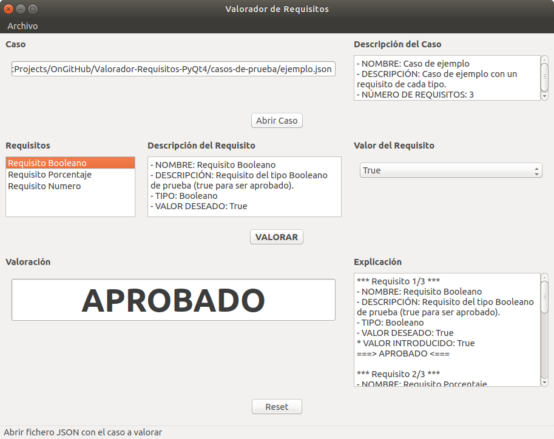

# Valorador Criterios PyQt4

**Trabajo final de la asignatura Ingeniería Sistemas Software Basados en Conocimiento.**

Programa valorador de criterios desarrollado con PyQt4 siguiendo la arquitectura Modelo-Vista-Controlador y la metodología CommonKADS. Permite llevar a cabo la tarea de valoración de CommonKADS sobre diferentes dominios de aplicación.




## Funcionamiento 

El programa cuenta una interfaz gráfica para que el usuario pueda introducir el valor de cada criterio y comprobar el resultado de la tarea de valoración de forma cómoda.

Cada caso (dominio) cuenta con una serie de criterios que serán evaluados de forma independiente: si un solo criterio es rechazado todo el caso será rechazado.

Los casos y todos sus criterios se cargan a través de un fichero JSON con el siguiente formato:

```
{
  "caso": {
    "nombre": "Caso de ejemplo",
    "descripcion": "Caso de ejemplo con un criterio de cada tipo.",
    "criterios": [
      {
        "nombre": "Criterio Booleano",
        "descripcion": "Criterio del tipo Booleano de prueba (true para ser aprobado).",
        "tipo": "Booleano",
        "valor_deseado": true
      },
      {
        "nombre": "Criterio Porcentaje",
        "descripcion": "Criterio del tipo Porcentaje de prueba (entre 0.5 y 1 para ser aprobado).",
        "tipo": "Porcentaje",
        "valor_minimo": 0.5,
        "valor_maximo": 1
      },
      {
        "nombre": "Criterio Numero",
        "descripcion": "Criterio del tipo Numero de prueba (entre 0 y 1500 para ser aprobado).",
        "tipo": "Numero",
        "valor_minimo": 0,
        "valor_maximo": 1500
      }
    ]
  }
}
```

El programa trabaja con tres tipos de criterios:

* Criterio Booleano: Su valor es True o False. El criterio será valorado como "Aprobado" si el valor introducido coincide con el `valor_deseado` indicado en el JSON.

* Criterio Porcentaje: Su valor es un porcentaje (0% - 100%) expresado con un número decimal (0.0 - 1.0). El criterio será valorado como "Aprobado" si el valor introducido se encuentra entre los valores `valor_minimo` y `valor_maximo` especificados en el JSON.

* Criterio Numero: Su valor es un número (entero o decimal). El criterio será valorado como "Aprobado" si el valor introducido se encuentra entre los valores `valor_minimo` y `valor_maximo` especificados en el JSON.


## Autores

* Andrés Salinas Lima
